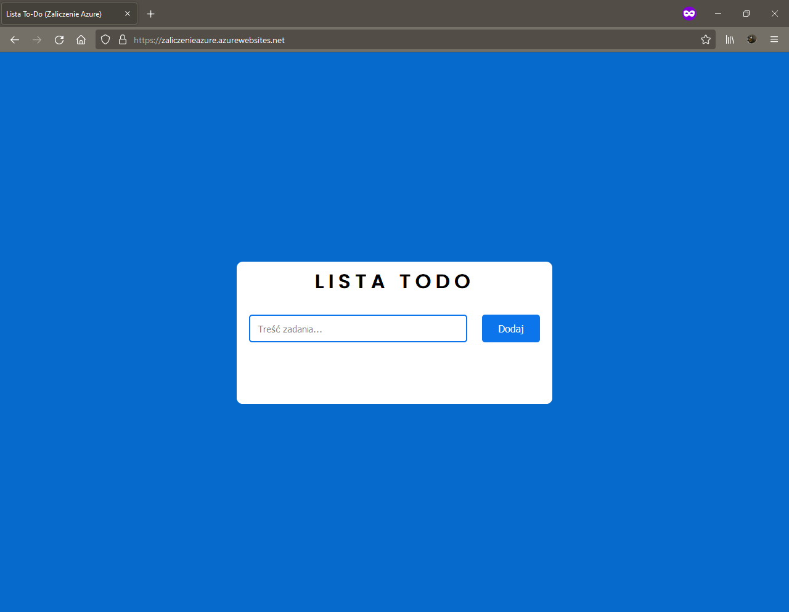
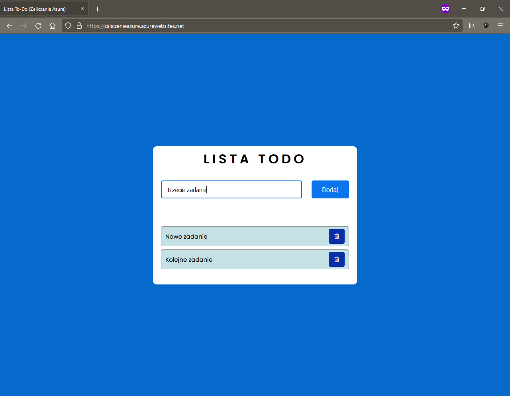
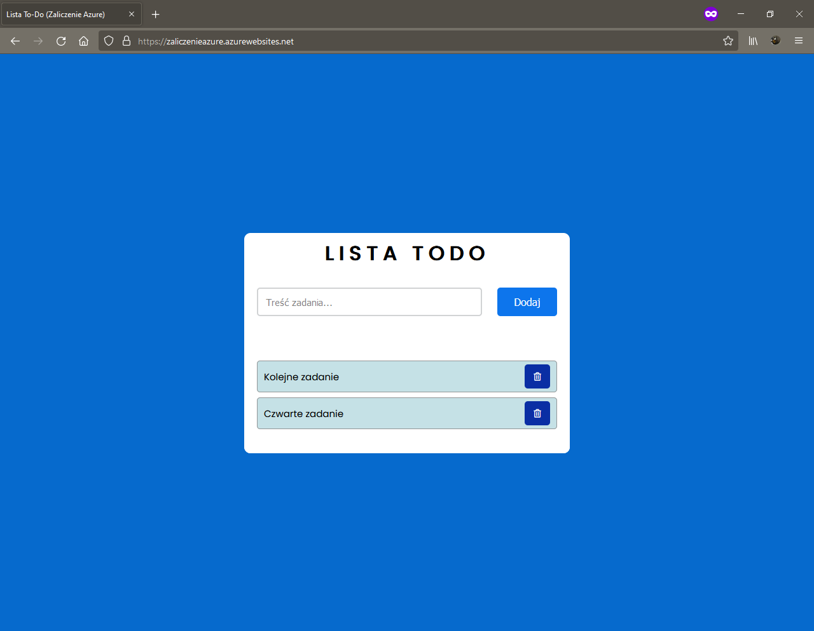

# Podstawowe informacje
- Aplikacja: Lista To-Do
- Autor: Mikołaj Pięcek 10261
- Przedmiot: WAW_Integracja oprogramowania z platformą Azure (Laboratorium)

# Opis aplikacji
Aplikacja, którą postanowiłem zbudować to prosta lista To-Do. Posiada ona tylko dwie funkcjonalności: dodawanie nowego wpisu do listy oraz usuwanie istniejącego wpisu z listy.

# Kod aplikacji
Cały kod, którego użyłem do zbudowania tej aplikacji znajduje się w pliku **index.php**.

# Opis wdrożenia
Wdrożenie aplikacji przeprowadziłem poprzez wiersz poleceń systemu Windows używając Azure CLI. Zdecydowałem się na to rozwiązanie ze względu na wygodę oraz prostotę jego użycia - przy użyciu jednej komendy mogłem wygenerować zasoby niezbędne do działania mojej aplikacji oraz ją nazwać i wdrożyć.

Komendę zawarłem w pliku **azure-command.txt**.

# Opis zastosowanych rozwiązań
Utworzyłem domyślną grupę zasobów, App Service, oraz aplikację internetową. Jako system operacyjny wybrałem Linux, a język programowania ustawiłem na PHP w wersji 8.0 - chociaż aplikację zbudowałem korzystając z HTML, CSS i JavaScriptu.

# Pliki .json z Azure
Pliki .json zawarłem w katologu **json_files**.

# Wyliczony budżet zużycia zasobów platformy Azure na jeden miesiąc
todo...

# Zrzuty ekranu działającej aplikacji

